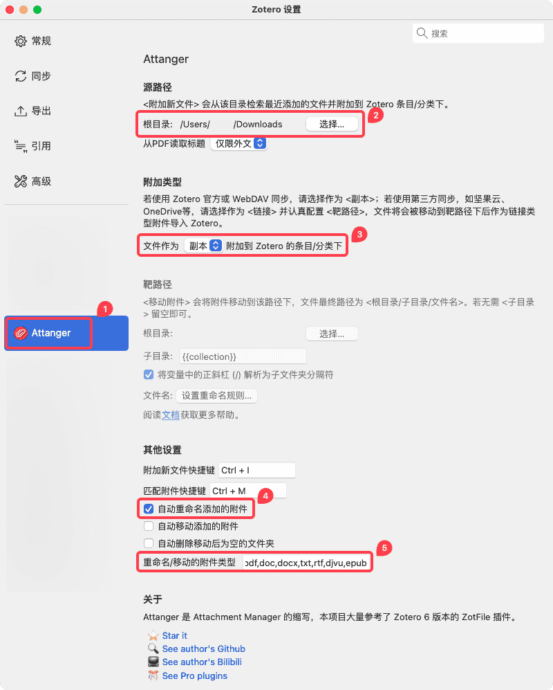
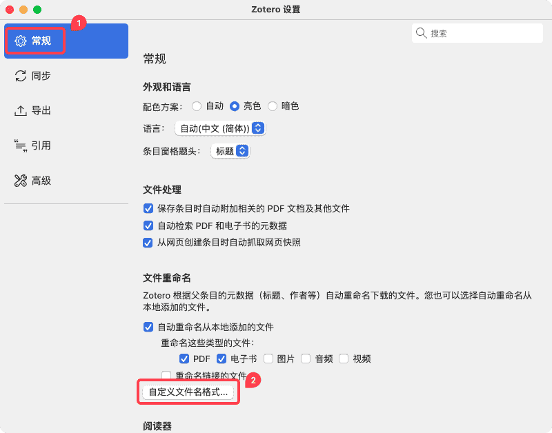
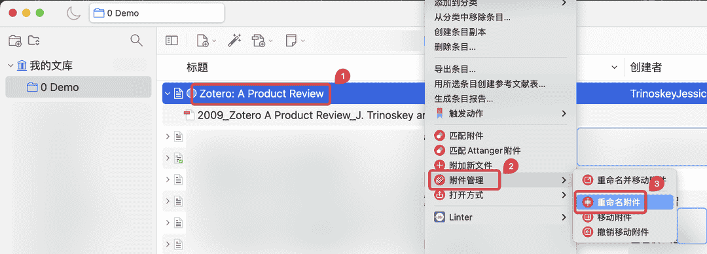

# Zotero Attanger 插件使用指南

Zotero Attanger 是一款专为 Zotero 7 设计的附件管理插件，旨在替代不再支持 Zotero 7 的 ZotFile 插件。它提供了更强大的附件管理功能，支持多设备同步和自定义规则，适合需要定制化管理文献附件的用户。

[[TOC]]

---

## 一、插件简介

Zotero Attanger 的主要功能包括：

- **便捷的添加附件方式**：为条目一键附加本地已经下载好的附件。
- **附件重命名增强**：在重命名附件时，同时将该附件在 Zotero 中的标题改为与附件的文件名一致。
- **附件外部存储增强**：借助 Zotero 的「链接的文件」功能，将附件按照自定义规则移动至 Zotero 数据文件夹之外的其他目录。
- **基于同步盘的多设备同步**：通过第三方云盘（如 iCloud、OneDrive、百度云盘同步空间、阿里云盘备份盘）实现附件跨设备同步。

- 项目主页：[GitHub](https://github.com/MuiseDestiny/zotero-attanger)

::: warning 警告

如果您的主要用途是云同步，请注意：

- 使用 Attanger + 同步盘的同步方案并非首选，我们优先推荐使用支持 WebDAV 的网盘来进行同步（请参阅 [通过 WebDAV 同步附件](../sync#通过-webdav-同步附件) 文档章节）；推荐仅当拟使用的同步服务不支持 WebDAV 时，再使用这种方式。
- 这种方式不支持同步到 Zotero 官方 iOS 和 Android 客户端。
- 不正确的配置可能导致附件丢失。

:::

## 二、安装步骤

### 2.1. 下载插件

插件下载教程：[获取插件教程](about-plugin#获取插件)

插件下载地址：

- [国内镜像](https://zotero-chinese.com/plugins/#search=Zotero+Attanger)
- [GitHub Release](https://github.com/MuiseDestiny/zotero-attanger/releases)

### 2.2. 安装插件

插件安装教程：[安装插件教程](about-plugin#安装插件)

## 三、基础配置指南 <Badge text="初级" />

Zotero Attanger 中较为简单的基础功能有：

- **匹配附件**：为条目补充附件
- **附加新文件**：为条目补充附件
- **重命名附件**：重命名附件、在文献列表中的附件标题上直接看到附件文件名

如果您只需要使用这些基础功能，请参考以下步骤进行配置。

### 3.1. 基础配置

1. 打开 Zotero，点击 **编辑 → 设置 → Attanger**。
   
2. 将「源路径」的「根目录」设置为浏览器的默认下载目录（如 `C:\Users\你的系统用户名\Downloads`）。
3. 在「附加类型」中选择「副本」。
4. 勾选「其他设置」中的「自动重命名添加的附件」选项，取消勾选「自动移动添加的附件」选项。
5. 在「重命名/移动的附件类型」中添加需要处理的更多文件格式的后缀名（如 `.caj` 等）。
6. 在 Zotero 设置中按需设置重命名规则。

:::: details Zotero 文件重命名规则设置教程

1. 打开 Zotero 设置中「常规」选项卡 →「文件重命名」中点击「自定义文件名格式...」按钮，打开 Zotero 的文件名格式设置窗口。
   
2. 在文件名格式设置窗口中，您可以根据需要自定义文件名模板。您可以访问以下链接，了解更多关于文件名模板的编写方法：

   - [Zotero 文件重命名规则生成器](https://www.wieke.cn/tools/rename-rule-generator.html)
   - [Zotero 官方文档：File Renaming](https://www.zotero.org/support/file_renaming)

   这里提供几个文件名模板案例供尝试，您可以直接点击规则框中右侧的「复制」按钮复制这一规则，然后在 Zotero 的文件名格式设置窗口中粘贴到「文件名模板」文本框中。

   ::: details 案例 1：「发表年份*标题*作者\_文献类型」，支持中文和外文文献姓名的不同处理，不显示「等」或「et al.」等字样。

   ```
   {{ year suffix="_" }}{{ title truncate="50" suffix="_" }}{{ if language =="zh" }}{{ authors name="family-given" name-part-separator="" join=" " max="2" }}{{ elseif language =="zh-CN" }}{{ authors name="family-given" name-part-separator="" join=" " max="2" }}{{ elseif language =="zh_CN" }}{{ authors name="family-given" name-part-separator="" join=" " max="2" }}{{ else }}{{ authors name="given-family" initialize="given" join=" and " max="2" }}{{ endif }}{{ itemType localize="true"  prefix="_" }}
   ```

   使用效果：

   - `2023_供需适配视角下消费帮扶的长效机制研究_王瑞_学位论文.pdf`
   - `2023_计及用户意愿的电动汽车聚合商主从博弈优化调度策略_房宇轩 胡俊杰_期刊文章.pdf`
   - `2009_Zotero A Product Review_J. Trinoskey and F. Brahmi_期刊文章.pdf`
   - `2014_数值分析_SauerTimothy_图书.pdf`

   :::

   ::: details 案例 2：「发表年份*标题*作者\_文献类型」，支持中文和外文文献姓名的不同处理，不显示「等」或「et al.」等字样。当条目类型是期刊文章时，文献类型不显示。

   ```
   {{ year suffix="_" }}{{ title truncate="50" suffix="_" }}{{ if language =="zh" }}{{ authors name="family-given" name-part-separator="" join=" " max="2" }}{{ elseif language =="zh-CN" }}{{ authors name="family-given" name-part-separator="" join=" " max="2" }}{{ elseif language =="zh_CN" }}{{ authors name="family-given" name-part-separator="" join=" " max="2" }}{{ else }}{{ authors name="given-family" initialize="given" join=" and " max="2" }}{{ endif }}{{ if itemType != "journalArticle" }}{{ itemType localize="true"  prefix="_" }}{{ endif }}
   ```

   使用效果：

   - `2023_供需适配视角下消费帮扶的长效机制研究_王瑞_学位论文.pdf`
   - `2023_计及用户意愿的电动汽车聚合商主从博弈优化调度策略_房宇轩 胡俊杰.pdf`
   - `2009_Zotero A Product Review_J. Trinoskey and F. Brahmi.pdf`
   - `2014_数值分析_SauerTimothy_图书.pdf`

   :::

   ::: details 案例 3：「发表年份*标题*作者\_文献类型」，支持中文和外文文献姓名的不同处理，不显示「等」或「et al.」等字样。当条目类型是期刊文章时，文献类型不显示。对于书籍类型的条目，将文献类型写在最前，发表年份写在最后。

   ```
   {{ if itemType == "book" }}{{ itemType localize="true"  suffix="_" }}{{ else }}{{ year suffix="_" }}{{ endif }}{{ title truncate="50" suffix="_" }}{{ if language =="zh" }}{{ authors name="family-given" name-part-separator="" join=" " max="2" }}{{ elseif language =="zh-CN" }}{{ authors name="family-given" name-part-separator="" join=" " max="2" }}{{ elseif language =="zh_CN" }}{{ authors name="family-given" name-part-separator="" join=" " max="2" }}{{ else }}{{ authors name="given-family" initialize="given" join=" and " max="2" }}{{ endif }}{{ if itemType != "journalArticle" }}{{ if itemType == "book" }}{{ year prefix="_" }}{{ else }}{{ itemType localize="true"  prefix="_" }}{{ endif }}{{ endif }}
   ```

   使用效果：

   - `2023_供需适配视角下消费帮扶的长效机制研究_王瑞_学位论文.pdf`
   - `2023_计及用户意愿的电动汽车聚合商主从博弈优化调度策略_房宇轩 胡俊杰.pdf`
   - `2009_Zotero A Product Review_J. Trinoskey and F. Brahmi.pdf`
   - `图书_数值分析_SauerTimothy_2014.pdf`

   :::

3. 当您在文库中选择了一个条目时，窗口中的「预览」部分会显示当前条目的文件名格式。
   

::::

7. 如果您需要同步附件文件，请阅读：[WebDAV 附件同步教程](../sync#通过-webdav-同步附件)。

### 3.2. 使用基础功能

1. 在 Zotero 中选中一个条目，点击右键，选择「匹配附件」，即可从源路径中根据标题自动匹配附件并添加到该条目中。
   

2. 在 Zotero 中选中一个条目，点击右键，选择「附加新文件」，即可从源路径中自动匹配最新的附件并添加到该条目中。

3. 在 Zotero 中选中一个条目，点击右键，选择「附件管理」→ 「重命名附件」，即可将该条目的附件重命名为文件名格式设置中的规则，并将该条目中的附件标题改为与附件的文件名一致。
   

## 四、进阶配置指南 <Badge text="中级" />

如果您需要使用 Attanger 的高级功能，或者需要使用第三方同步盘来实现附件的多设备同步，请务必仔细阅读下面的进阶配置文档：

::::: details 进阶配置文档

## J1. 进阶配置 <Badge text="中级" />

Zotero Attanger 各项功能需要的配置项不同，具体如下：

| 功能名                                      | 用途                                                      | 具体功能说明                                                                                                                                                                                                                    | 需要的配置项                                                          |
| ------------------------------------------- | --------------------------------------------------------- | ------------------------------------------------------------------------------------------------------------------------------------------------------------------------------------------------------------------------------- | --------------------------------------------------------------------- |
| 匹配附件<br><Badge text="初级" />           | 为条目补充附件                                            | 本功能将源路径中与条目信息匹配的文件添加到 Zotero 中。在「源路径」目录下（不包括子目录）搜索所有的`.pdf`和`.caj`文件，然后对于所有选中的文献条目，使用匹配文件名和标题的方法，匹配并添加某个文件作为该条目的附件。              | 源路径                                                                |
| 匹配 Attanger 附件<br><Badge text="高级" /> | 仅用作特殊用途                                            | 相比于「匹配附件」，本功能的匹配规则更加严格，具体请阅读表格下方的详细功能说明。                                                                                                                                                | 源路径、靶路径、重命名规则、重命名/移动的附件类型、已链接附件的根目录 |
| 附加新文件<br><Badge text="初级" />         | 为条目补充附件                                            | 将源路径中最新的文件添加到 Zotero 中。相比于「匹配附件」，本功能既不会检查文件名和标题是否匹配，也不检查附件的类型，而是直接将「源路径」目录下（不包括子目录）最新的文件添加到 Zotero 中作为该条目的附件。                      | 源路径                                                                |
| 重命名并移动附件<br><Badge text="中级" />   | 同时进行「重命名附件」和「移动附件」两项操作              | 具体功能请参考「重命名附件」和「移动附件」。                                                                                                                                                                                    | 重命名规则、重命名/移动的附件类型                                     |
| 重命名附件<br><Badge text="初级" />         | 重命名附件、在文献列表中的附件标题上直接看到附件文件名    | 将附件的文件名按照 Zotero 的文件名格式（重命名规则）进行重命名，同时将该附件在 Zotero 中的标题改为与附件的文件名一致，从而确保在文献列表中看到的附件标题与实际文件名一致。                                                      | 重命名规则、重命名/移动的附件类型                                     |
| 移动附件<br><Badge text="中级" />           | 第三方同步盘同步附件、自定义规则整理附件                  | 将附件按照「靶路径」的设定移动到指定的靶路径中，并将附件作为链接的文件存储，不再由 Zotero 直接管理。这一功能仅在选择了「作为链接」的方式来存储附件时才会生效。                                                                  | 源路径、靶路径、重命名规则、重命名/移动的附件类型、已链接附件的根目录 |
| 撤销移动附件<br><Badge text="初级" />       | 从第三方同步盘方案切换回 Zotero 官方/ WebDAV 文件同步方案 | 将链接的文件重新作为副本存储在 Zotero 数据目录中，重新由 Zotero 管理。此功能不仅对靶目录中的附件有效，也对其他任意链接的文件有效。这个功能与 Zotero 菜单栏中的「工具」→「管理附件」→「转换已链接文件为已存储文件...」功能相同。 | 无                                                                    |

:::: details 「匹配 Attanger 附件」功能说明 <Badge text="高级" />

::: warning 提醒

这个功能所需的配置复杂，对双方的操作都有较高的要求，使用中存在较多的人工操作，我们强烈不建议一般用户使用这种方式来为群组文库同步附件。

:::

在选中了一个文献条目，并点击了「匹配 Attanger 附件」时，Attanger 会到`源路径(设为与靶路径根目录相同)\靶路径子目录`中匹配符合文件「重命名规则」, 且文件类型是「重命名/移动的附件类型」中任意一种的文件。如果存在这个文件，且这个文件还没有作为被选中条目的附件，则将其作为链接的附件添加到这个条目中。这里需要注意的是，只有在靶路径中符合设定的子目录下的文件才会被匹配到。如果附件在靶路径中的其他子目录内，则不会匹配到。

这个功能在设计之初是为了给群组文库提供一种不使用 Zotero 官方文件同步的附件同步方式，详见[原作者的说明](https://github.com/MuiseDestiny/zotero-attanger/pull/206)。主体思想是通过第三方同步盘来实现附件的同步，通过群组文库仅同步文献条目元数据，手动将需要分享的条目在本地文库和群组文库之间复制，并借助这一功能快速为没有附件的条目匹配到同步盘中的附件。主要步骤如下：

1. 分享者借助第三方同步盘在电脑上设置一个同步文件夹，并在 Attanger 中配置好「靶路径根目录」和「已链接附件的根目录」，规定好「靶路径子目录」的结构和文件「重命名规则」。
2. 接收者也使用分享者的同步盘在自己的电脑上设置好一个同步文件夹，并在 Attanger 中配置好自己的「靶路径根目录」和「已链接附件的根目录」，并确定「靶路径子目录」和文件「重命名规则」的设定与分享者的完全一致。
3. 新建一个群组文库，在群组文库中创建好需要分享的文献分类（和子分类）。分享者和接收者也都在自己的本地 Zotero 我的文库中创建同名的分类（和子分类），确保各个文库中用于同步的分类具有完全相同的结构和层级。
4. 分享者在本地 Zotero 我的文库中将需要分享的条目（含附件）添加到我的文库中用于分享的分类里，并借助 Attanger 将附件重命名并移动到靶路径（同步盘）中。
5. 分享者在本地 Zotero 我的文库中将需要分享的文献条目复制到群组文库中对应的的分类（子分类）里。
6. 接收者将群组文库中的文献条目复制到自己的本地 Zotero 我的文库中对应的的分类（子分类）里。
7. 接收者使用 Attanger 的「匹配 Attanger 附件」功能，为本地 Zotero 我的文库中刚刚复制的条目匹配并以链接的文件添加附件。

这种方案有以下局限和注意事项：

1. 分享者和接收者的文件重命名规则必须完全一致，否则会因文件名不同无法匹配。
2. 分享者和接收者的靶路径子目录的设定必须完全一致。如果子目录是以分类建立的，那么分享者和接收者的分类（子分类）必须完全一致，否则会因附件所在的子目录不同无法匹配。
3. 分享者在将条目添加到本地 Zotero 我的文库中用于分享的分类时，应执行一次「重命名并移动附件」操作，确保附件已经被重命名并移动到这一分类对应的靶路径子目录中。如果这个文献条目同时还被添加到了其他本地分类中，此时必须确保附件实际存放的子目录只能是用于同步的这个分类对应的子目录，而不是其他分类对应的子目录。
4. 由于接收者的条目是从群组文库中复制的，双方本地文库中的两个条目可以看作是内容完全相同的重复条目。在遇到协作创作文档时，双方都只能使用群组文库中的条目进行引用，而不是使用本地文库中的条目，否则可能会因为重复条目而出现重复的书目。
5. Zotero 目前会将附件的各种批注存在 Zotero 数据库中，而不是直接写入附件文件中。因此，这种方式只能分同步附件，而不能同步使用 Zotero 内置阅读器做的批注。接收者收到的只是没有批注的原始 PDF 文件。如果有同步批注的需求，可能只能使用第三方阅读器进行批注，否则将会需要大量的额外操作来导出批注。
6. 由于源路径须设置与靶路径相同，使用这一方案后无法再方便地用 Attanger 的匹配附件、匹配新附件等功能来为条目添加附件。

::::

### J1.1. 附加类型设置

这一设置项用于配置 Attanger 处理附件的方式，默认选择作为「副本」存储附件，由 Zotero 管理附件。您可以根据需要选择「作为链接」存储附件。

打开 Zotero，点击 **编辑 → 设置 → Attanger**。根据需求选择附件存储方式：

- **作为「副本」**<Badge text="初级" /> ：

  此时附件在 Zotero 中也被称之为「已存储文件」或「存储的附件」，文献列表中的附件图标上**没有链条符号**。此时附件存储在 Zotero 数据目录中 `storage` 文件夹下的随机字符文件夹内，此时附件直接由 Zotero 管理，适合使用 Zotero 官方同步或 WebDAV 同步。这种方案简单易用，不需要复杂的配置和操作，且不容易出问题。

- **作为「链接」**<Badge text="中级" /> ：

  此时附件在 Zotero 中也被称之为「已链接文件」或「链接的附件」，文献列表中的附件图标上**有链条符号**。此时附件会被移动至自定义的靶目录中，Zotero 仅保留附件的链接（类似于 Windows 中的快捷方式），不再由 Zotero 直接管理，也无法使用 Zotero 官方的文件同步和 WebDAV 同步。此选项必须配合「靶路径」设置使用，同时建议正确配置「已链接附件的根目录」方便多设备同步。

对于「副本」和「链接」的详细说明，请阅读这篇文档：[存储的附件和链接的附件](../add-attachments.md#存储的附件和链接的附件)。

::: warning 重要提醒

我们强烈建议使用 **作为「副本」** 的方式来存储附件，此方式由 Zotero 管理附件，更简单易用，不需要复杂的配置和操作，且不容易出问题。

选择 **作为「链接」** 的方式来存储附件时，附件将被转换为「链接的附件」，不再由 Zotero 直接管理。如果配置不当或操作不当，可能会导致 Zotero 无法打开附件，或者附件无法在其他设备上访问。

如果您确定要使用 **「链接」** 的方式来存储附件，请务必确保您仔细阅读了本文档，完全理解各项设置的含义以及使用的注意事项，并且正确配置 Zotero Attanger 插件设置中的「靶路径」和 Zotero 高级设置中的「已链接附件的根目录」。

:::

### J1.2. 路径配置

Zotero Attanger 在使用时涉及到多个路径配置项，主要包括：

| 设置所在位置             | 路径名称           | 用途                                                                                         | 设置建议                                                                                                                                                    |
| ------------------------ | ------------------ | -------------------------------------------------------------------------------------------- | ----------------------------------------------------------------------------------------------------------------------------------------------------------- |
| Zotero 高级设置          | 数据文件夹         | Zotero 数据库所在的文件夹，存储 Zotero 除程序文件和配置设置外的所有数据                      | 由 Zotero 自动设置，一般不建议修改。可设为其他本地目录，但**切勿设为任何云盘的同步目录，切勿使用任何工具同步这一目录**。 使用 Attanger 不需要修改这一目录。 |
| Zotero 高级设置          | 已链接附件的根目录 | 配置后可将这一根目录下的文件使用相对路径进行存储，方便在使用第三方同步盘方案时进行多设备同步 | 可设置为云盘的同步目录，需与 Attanger 插件设置中的靶路径根目录一致。作为「副本」存储文件时无需设置这一目录。                                                |
| Zotero Attanger 插件设置 | 源路径             | 利用 Attanger 匹配/附加文件时，搜索的源目录                                                  | 可设置为浏览器的默认下载目录。                                                                                                                              |
| Zotero Attanger 插件设置 | 靶路径             | Attanger 移动附件时，附件存放的目标目录                                                      | 可设置为云盘的同步目录，需与 Zotero 高级设置中的「已链接附件的根目录」一致。 作为「副本」存储文件时无需设置这一目录。                                       |

::: danger

无论你选择何种同步方案， 切勿将 Zotero 的 `数据存储位置/Data Directory` 自定义为任何网盘的同步文件夹中（包括 iCloud），也切勿使用任何网盘/同步盘的备份功能直接同步/备份这一目录 ！（包括但不限于直接使用坚果云的官方客户端直接同步备份这一文件夹）

这样做在某些情况下可能会导致你的 Zotero 数据库损坏，带来严重的问题！官方对于这一问题的说明见这两篇文章：

- [How can I access my library from multiple computers?](https://www.zotero.org/support/sync#alternative_syncing_solutions)
- [Can I store my Zotero data directory in a cloud storage folder?](https://www.zotero.org/support/kb/data_directory_in_cloud_storage_folder)

:::

#### J1.2.1 Zotero Attanger 插件的「源路径」设置 <Badge text="初级" />

在不使用插件时，如果想为文献条目添加附件，通常需要手动将文件拖拽到 Zotero 中的条目上，或者使用 Zotero 的「添加附件」功能来选择文件。使用 Attanger 插件后，可以通过「匹配附件」和「附加新文件」功能来自动为条目添加附件。「匹配附件」功能会在指定的源路径中搜索符合条件的文件，并将其添加到 Zotero 中的条目下；「附加新文件」功能会将源路径中最新的文件添加到 Zotero 中的条目下。这两个功能的最终效果等同于将文件拖拽到 Zotero 中的条目上。

::: tip 提示

在 Attanger 匹配/附加文件时，会在指定的源路径中搜索符合条件的文件。这一设置项仅与「匹配附件」和「附加新文件」功能相关。因此，无论您将附加类型设置为「副本」还是「链接」，都建议您设置这一项。

:::

一般来说，您可以将源路径设置为浏览器的默认下载目录（如 `C:\Users\你的系统用户名\Downloads`），这样在使用「匹配附件」时，Attanger 会自动在下载目录下匹配符合条件的文件，或使用「附加新文件」功能自动将刚下载的文件添加到条目中。如果您有其他文件夹需要搜索，也可以将源路径设置为该文件夹。需要注意的是，「匹配附件」和「附加新文件」功能仅会在源路径的根目录下搜索文件，不会搜索该路径下其他子目录中的文件。

#### J1.2.2 Zotero Attanger 插件的「靶路径」设置 <Badge text="中级" />

如果在「附加类型」中选择将文件作为「链接」附加到条目下，Attanger 在「移动附件」时，会将附件重命名并移动到指定的靶路径中。文件的最终路径为`根目录/子目录/文件名.扩展名`。

在作为「链接」存储文件时，您需要设置以下两项「靶路径」的设置：

- **根目录**：根目录在作为「链接」存储时必填，可以设置为云盘同步目录（如 `D:\OneDrive\ZoteroAttachment`），如果没有同步需求也可以设为普通本地目录。如果您有多个设备，请在每一个设备上根据实际情况选择相应的目录。这一项需要与 Zotero 高级设置中的「已链接附件的根目录」一致。
- **子目录**：子目录结构支持自定义，可以留空。如果这一项留空，则所有附件都将存放在根目录下。这一项默认设置为 `{{collection}}` ，即自动创建与 Zotero 中的分类结构一致的子目录。并将附件存放在对应的子目录中。您也可以根据需要设置为其他值（如设置为 `{{year}}` 时按照文献的发表年份整理附件），也可以用正斜杠作为子文件夹分隔符，设置多级子目录（如设置为 `{{collection}}/{{year}}` 时会在分类目录下创建年份二级子目录来整理附件）。这里可用的变量详见：[[Zotero 官方文档] File Renaming](https://www.zotero.org/support/file_renaming)

#### J1.2.3 Zotero 高级设置中的「已链接附件的根目录」设置 <Badge text="中级" />

为方便多设备同步，您需要在 Zotero 高级设置中配置「已链接附件的根目录」。这一项需要与 Attanger 插件设置中的靶路径根目录一致。

- **已链接附件的根目录**：在 Zotero 高级设置中，将「已链接附件的根目录」设置为与靶路径相同的目录（如 `D:\OneDrive\ZoteroAttachment`）。

::: details 「已链接附件的根目录」详细说明

「已链接附件的根目录」不是必填项。如果不设置这一项，各个附件的链接路径将会是绝对路径。如果您在其他设备上使用不同的靶路径，则无法访问附件，因为绝对路径在不同设备上是不同的。在设置了这一项后，各个附件的在 Zotero 存储的链接路径将会是相对路径。这样在同步时，各个设备可根据当前设备的实际情况设置相应的靶路径根目录，Zotero 会自动将相对路径与当前设备的根目录路径拼接为绝对路径，而不会因为根路径不同而导致附件无法访问。

这里举例说明一下「已链接附件的根目录」的作用：

- 假设在当前设备 A 将「靶路径根目录」设置为 `D:\OneDrive\ZoteroAttachment`，子目录设置为 `{{collection}}`，那么对于 `文献综述` 分类中的附件 `2025最新权威文献综述.pdf` ，且未设置「已链接附件的根目录」，Zotero 会将其链接路径存储为绝对路径： `D:\OneDrive\ZoteroAttachment\文献综述\2025最新权威文献综述.pdf`。如果在另一个设备 B 上的靶路径根目录（同步文件夹路径）是 `C:\Users\PC2\OneDrive\ZoteroAttachment`），则无法访问该附件，因为在这一电脑上的 `D:\OneDrive\ZoteroAttachment\文献综述\2025最新权威文献综述.pdf` 路径上没有这一文件。
- 如果在当前设备 A 将「已链接附件的根目录」设置为 `D:\OneDrive\ZoteroAttachment`，其他设置与前文所述保持一致，那么对于当前设备 A 上的附件 `D:\OneDrive\ZoteroAttachment\文献综述\2025最新权威文献综述.pdf` ，Zotero 会将其链接路径存储为相对路径： `文献综述/2025最新权威文献综述.pdf`。此时，只需要将另一个设备 B 上的「已链接附件的根目录」设置为 `C:\Users\PC2\OneDrive\ZoteroAttachment`（与该设备的靶路径根目录、同步文件夹路径一致），Zotero 就会自动将另一个设备 B 的根目录路径拼接为适合该设备的绝对路径： `C:\Users\PC2\OneDrive\ZoteroAttachment\文献综述\2025最新权威文献综述.pdf`，从而保证了「靶路径根目录」不同时附件的正常同步。

这一项仅对「链接的附件」有效，作为「副本」存储的文件完全由 Zotero 管理，不受这一选项的影响。

:::

### J1.3. 其他设置

Zotero Attanger 提供了一些其他设置选项，包括添加附件时自动移动、自动重命名等。这里主要对「重命名规则」和「重命名/移动的附件类型」进行说明。

#### J1.3.1. 重命名规则 <Badge text="中级" />

Zotero Attanger 目前直接使用 Zotero 本身的文件重命名规则。无论将文件作为「副本」还是「链接」存储，均可使用该规则进行重命名。

- 您可以点击「靶路径」设置中的「设置重命名规则...」按钮，打开 Zotero 的文件名格式设置窗口。
- 您也可以直接在 Zotero 设置中「常规」选项卡 →「文件重命名」中点击「自定义文件名格式...」按钮，打开 Zotero 的文件名格式设置窗口。

您可以阅读下面的文件重命名规则设置教程，了解如何设置文件名格式。

:::: details Zotero 文件重命名规则设置教程

在文件名格式设置窗口中，您可以根据需要自定义文件名模板。当您在文库中选择了一个条目时，窗口中的「预览」部分会显示当前条目的文件名格式。如果需要定制自己的文件名模板，您可以访问以下链接，了解更多关于文件名格式的设置方法：

- [Zotero 文件重命名规则生成器](https://www.wieke.cn/tools/rename-rule-generator.html)
- [Zotero 官方文档：File Renaming](https://www.zotero.org/support/file_renaming)。

这里提供几个文件名模板案例供尝试，您可以直接点击规则框中右侧的「复制」按钮复制这一规则，然后在 Zotero 的文件名格式设置窗口中粘贴到「文件名模板」文本框中。

::: details 案例 1：「发表年份*标题*作者\_文献类型」，支持中文和外文文献姓名的不同处理，不显示「等」或「et al.」等字样。

```
{{ year suffix="_" }}{{ title truncate="50" suffix="_" }}{{ if language =="zh" }}{{ authors name="family-given" name-part-separator="" join=" " max="2" }}{{ elseif language =="zh-CN" }}{{ authors name="family-given" name-part-separator="" join=" " max="2" }}{{ elseif language =="zh_CN" }}{{ authors name="family-given" name-part-separator="" join=" " max="2" }}{{ else }}{{ authors name="given-family" initialize="given" join=" and " max="2" }}{{ endif }}{{ itemType localize="true"  prefix="_" }}
```

使用效果：

- `2023_供需适配视角下消费帮扶的长效机制研究_王瑞_学位论文.pdf`
- `2023_计及用户意愿的电动汽车聚合商主从博弈优化调度策略_房宇轩 胡俊杰_期刊文章.pdf`
- `2009_Zotero A Product Review_J. Trinoskey and F. Brahmi_期刊文章.pdf`
- `2014_数值分析_SauerTimothy_图书.pdf`

:::

::: details 案例 2：「发表年份*标题*作者\_文献类型」，支持中文和外文文献姓名的不同处理，不显示「等」或「et al.」等字样。当条目类型是期刊文章时，文献类型不显示。

```
{{ year suffix="_" }}{{ title truncate="50" suffix="_" }}{{ if language =="zh" }}{{ authors name="family-given" name-part-separator="" join=" " max="2" }}{{ elseif language =="zh-CN" }}{{ authors name="family-given" name-part-separator="" join=" " max="2" }}{{ elseif language =="zh_CN" }}{{ authors name="family-given" name-part-separator="" join=" " max="2" }}{{ else }}{{ authors name="given-family" initialize="given" join=" and " max="2" }}{{ endif }}{{ if itemType != "journalArticle" }}{{ itemType localize="true"  prefix="_" }}{{ endif }}
```

使用效果：

- `2023_供需适配视角下消费帮扶的长效机制研究_王瑞_学位论文.pdf`
- `2023_计及用户意愿的电动汽车聚合商主从博弈优化调度策略_房宇轩 胡俊杰.pdf`
- `2009_Zotero A Product Review_J. Trinoskey and F. Brahmi.pdf`
- `2014_数值分析_SauerTimothy_图书.pdf`

:::

::: details 案例 3：「发表年份*标题*作者\_文献类型」，支持中文和外文文献姓名的不同处理，不显示「等」或「et al.」等字样。当条目类型是期刊文章时，文献类型不显示。对于书籍类型的条目，将文献类型写在最前，发表年份写在最后。

```
{{ if itemType == "book" }}{{ itemType localize="true"  suffix="_" }}{{ else }}{{ year suffix="_" }}{{ endif }}{{ title truncate="50" suffix="_" }}{{ if language =="zh" }}{{ authors name="family-given" name-part-separator="" join=" " max="2" }}{{ elseif language =="zh-CN" }}{{ authors name="family-given" name-part-separator="" join=" " max="2" }}{{ elseif language =="zh_CN" }}{{ authors name="family-given" name-part-separator="" join=" " max="2" }}{{ else }}{{ authors name="given-family" initialize="given" join=" and " max="2" }}{{ endif }}{{ if itemType != "journalArticle" }}{{ if itemType == "book" }}{{ year prefix="_" }}{{ else }}{{ itemType localize="true"  prefix="_" }}{{ endif }}{{ endif }}
```

使用效果：

- `2023_供需适配视角下消费帮扶的长效机制研究_王瑞_学位论文.pdf`
- `2023_计及用户意愿的电动汽车聚合商主从博弈优化调度策略_房宇轩 胡俊杰.pdf`
- `2009_Zotero A Product Review_J. Trinoskey and F. Brahmi.pdf`
- `图书_数值分析_SauerTimothy_2014.pdf`

:::

当您在文库中选择了一个条目时，窗口中的「预览」部分会显示当前条目的文件名格式。


::::

#### J1.3.2. 重命名/移动的附件类型 <Badge text="中级" />

Zotero Attanger 支持多种文件类型的附件重命名和移动。您可以根据需要选择要处理的文件类型。默认支持 PDF、docx、txt 等格式。

如果您需要 Attanger 移动更多其他类型的文件，您可以在「重命名/移动的附件类型」中添加新的扩展名（如要使用 Attanger 移动 CAJ 文件，则在类型最后加上 `,caj` 即可）。

## J2. 基于同步盘的多设备同步实现

### J2.1. 同步逻辑

- Zotero Attanger 将附件重命名并移动到云盘目录，Zotero 仅保留附件链接。
- 云盘自动同步文件，其他设备通过附件链接打开本地同步好的附件。

### J2.2. 操作步骤

1. **首次同步**
   - 根据[配置指南](#三、配置指南)将[附加类型](#_3-1-附加类型设置)设为「链接」，并设置好[靶路径](#_3-2-2-zotero-attanger-插件的「靶路径」设置)和[已链接附件的根目录](#_3-2-3-zotero-高级设置中的「已链接附件的根目录」设置)。
   - 在「我的文库」中选中所有文献条目（键盘快捷键 `Ctrl` + `a`），右点击任意条目，然后点击 `附件管理` → `重命名并移动附件`（如无需重命名，可点击 `移动附件` ），将附件迁移至云盘。
   - 在「其他设置」中勾选「自动移动添加的附件」（并按需勾选「附加新文件快捷键」），未来新下载的附件会自动处理。
2. **新设备配置**：
   - 在其他设备上安装 Zotero Attanger，在做好文件夹同步后，将[附加类型](#_3-1-附加类型设置)设为「链接」，根据该设备的实际情况正确设置[靶路径](#_3-2-2-zotero-attanger-插件的「靶路径」设置)和[已链接附件的根目录](#_3-2-3-zotero-高级设置中的「已链接附件的根目录」设置)。
   - 各个设备上的「靶路径子目录」、「重命名规则」以及「重命名/移动的附件类型」设置最好保持一致。
   - 在「其他设置」中勾选「自动移动添加的附件」（并按需勾选「附加新文件快捷键」），未来新下载的附件会自动处理。

::: tip 提示

「坚果云」不是一种同步方式。坚果云既支持 Zotero 自带的 WebDAV 同步（不需要安装坚果云官方的客户端），也支持使用本文档 「Attanger + 同步盘」的方式来同步附件（需要安装坚果云官方的客户端）。通常来说，我们更建议您使用 WebDAV 同步的方式来同步附件，这样可以避免一些不必要的问题。如果您希望使用 WebDAV 同步，请参考这篇文章：[通过 WebDAV 同步附件教程](../sync.md#通过-webdav-同步附件)。

:::

## J3、进阶配置的常见问题

### J3.1. Zotero 中删除附件时，系统中的文件无法同步删除

这是 Zotero 链接的附件的特性。当您使用 Zotero 的「删除条目...」功能删除一个链接的附件时，Zotero 仅删除数据库中的链接，而不会删除链接指向的文件本身。

针对这一问题，您可以下载并安装 [Del Item With Attachment 插件](https://zotero-chinese.com/plugins/#search=Del+Item+With+Attachment)，然后在文库中选中需要删除的条目（或条目中的附件），右键点击，选择 「删除附件」→「删除条目和附件」，即可删除 Zotero 中的链接和系统中的文件。

::: tip 提示

请注意，使用 Del Item With Attachment 插件的功能删除附件时，即便条目只是被删除到回收站中，系统中的文件也会在点击时直接被删除，无法被恢复。如果条目从回收站中恢复，附件链接会无法打开，只能新下载一个附件，然后将失效的附件链接定位到新下载的附件上。

如果你选中的只是条目中的附件，您仍然可以使用 Del Item With Attachment 插件的「删除条目和附件」功能来删除附件。此操作不会导致附件所述的上级文献信息条目被删除，也不会导致其他未被选中的附件被删除。对于 Zotero 来说，此时删除的条目即为这个附件。

:::

### J3.2. 附件无法打开

如果遇到附件无法打开，通常是路径配置问题。请按照以下步骤检查：

1. 在添加这一附件的电脑上检查这一附件能否正常打开。如果所有设备都无法打开，可能说明这一附件已丢失，请重新下载。
2. 根据[路径配置](#J1.2.-路径配置)，检查「靶路径」和「已链接附件的根目录」设置是否正确。
3. 直接访问报错里提示找不到附件的路径，检查在该路径下是否存在该附件文件，以及该文件能否正常打开。如果不存在，清检查同步设置和路径设置。

### J3.3. 插件工作不正常

如果插件工作不正常，通常是插件和 Zotero 版本不匹配，或者插件插件版本过低。请按照以下步骤处理：

1. 更新 Zotero 版本：将 Zotero 更新到最新的正式版。可从 Zotero 官网下载最新的正式版覆盖安装。
2. 更新插件版本：按照[插件安装步骤](#二安装步骤)下载最新的插件安装包并覆盖安装。

### J3.4. 点击「移动附件」后，附件没有被移动

这种问题通常是由于「重命名/移动的附件类型」设置中没有您当前文件的后缀名，请在该设置中补充：

- 点击 Zotero → 编辑 → 设置 → Zotero Attanger，在「重命名/移动的附件类型」中添加文件后缀名（如 `,caj`），然后再尝试。

此外，只有拥有所属上级文献条目的附件才能被移动。如果您选中的附件是一个独立的顶级条目，则无法被移动。请先为该附件创建上级条目，完善条目信息，然后再尝试移动。

:::::

## 五、由链接的附件转换为存储的附件 <Badge text="初级" />

如果您希望从 Zotero Attanger + 同步盘 的同步方案切换到 Zotero 官方的 WebDAV 同步方案，您可以将链接的附件转换回存储的附件。操作步骤如下：

1. 将 Zotero Attanger 插件的「附加类型」设置为「副本」。
2. 在 Zotero 中选中所有文献条目（键盘快捷键 `Ctrl` + `a`），右击任意条目，然后点击 「附件管理」 → 「撤销移动附件」，将链接的附件转换为存储的附件。此操作会将链接的附件重新作为副本存储在 Zotero 数据目录中，重新由 Zotero 管理。在「转换为存储文件」窗口中，可以按需勾选「存储后删除原始文件」，删除靶目录中的原始文件，删除后附件只存在于 Zotero 数据目录中。
3. 如果需要设置 WebDAV 同步，请参考这篇文章：[通过 WebDAV 同步附件教程](../sync.md#通过-webdav-同步附件)。

::: tip 提示

如果您未安装 Attanger，您也可以在全选文献后，使用 Zotero 菜单栏中的「工具」→「管理附件」→「转换已链接文件为已存储文件...」功能，将链接的附件转换为存储的附件。Zotero Attanger 的「撤销移动附件」实际上使用的也是这一功能。

:::

## 八、其他注意事项

- **Zotero Attanger 仅支持 Zotero 7**：Zotero 6 用户需使用 ZotFile 插件。
- **请勿直接在系统移动文件或编辑文件名**：会导致 Zotero 无法打开附件。

## 九、提交反馈

如遇插件故障，可在 [GitHub Issues](https://github.com/MuiseDestiny/zotero-attanger/issues) 提交反馈。请配合截图清晰描述问题，并提供你的 Zotero 和 Attanger 插件的具体版本号。
